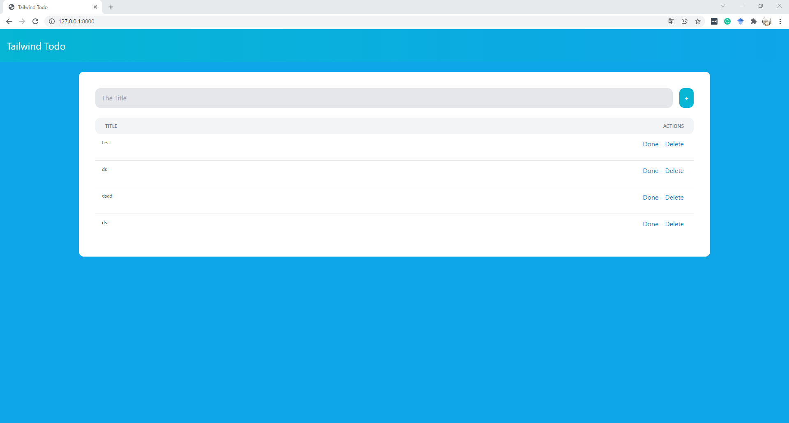
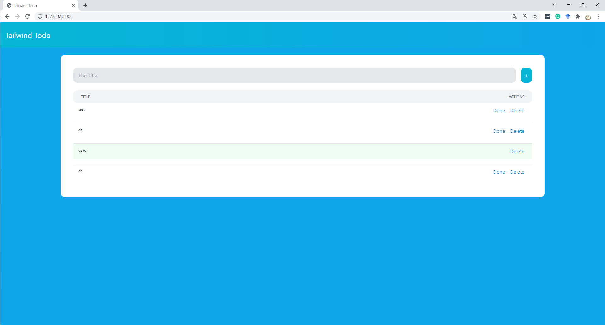

# Django Single Page Application for Tailwind CSS

DjangoとTailwind CSSで開発したSPA。構造は非常にシンプル。

**正直に言って、Tailwind CSSでのフロントエンド開発が一番難しかった。**

# 完成デモ

▼タスクを追加したり削除したりする。



▼完了済みのタスクには色がつく。




# 環境構築

まずは以下のコマンドを入力してDjangoのプロジェクトを出力させる。

```
pip install django
django-admin startproject backend .
django-admin startapp todo
```

`backend/settings.py`の定数`INSTALLED_APPS`に`todo`を追加。

```py
INSTALLED_APPS = [
    'django.contrib.admin',
    'django.contrib.auth',
    'django.contrib.contenttypes',
    'django.contrib.sessions',
    'django.contrib.messages',
    'django.contrib.staticfiles',
    'todo',
]
```

ディレクトリ構造をはっきりさせるため、定数`TEMPLATES`のディレクトリにあるキー`'DIRS'`の値に`BASE_DIR / 'templates'`と書く。

この際、`templates`フォルダを新しく作成する。


```py
TEMPLATES = [
    {
        'BACKEND': 'django.template.backends.django.DjangoTemplates',
        'DIRS': [BASE_DIR / 'templates'], #追加
        'APP_DIRS': True,
        'OPTIONS': {
            'context_processors': [
                'django.template.context_processors.debug',
                'django.template.context_processors.request',
                'django.contrib.auth.context_processors.auth',
                'django.contrib.messages.context_processors.messages',
            ],
        },
    },
]
```

# データベース作成

`todo/models.py`

```py
from django.db import models

class Todo(models.Model):
    title = models.CharField(max_length=100)　# タイトル：タスクの名前
    is_done = models.BooleanField(default=False) # 終了したかどうかの確認。二択になるのでTrueとFalseで表現する。
```

以下のコマンドを入力してデータベースを作成する。デフォルトは`db.sqlite3`。

```powershell
py manage.py makemigrations
py manage.py migrate
py manage.py createsuperuser #管理サイトにアクセスするためのusernameとpasswordを指定する
```

# 開発環境

* Django 4.0
* Tailwind CSS
* htmx 0.6.1